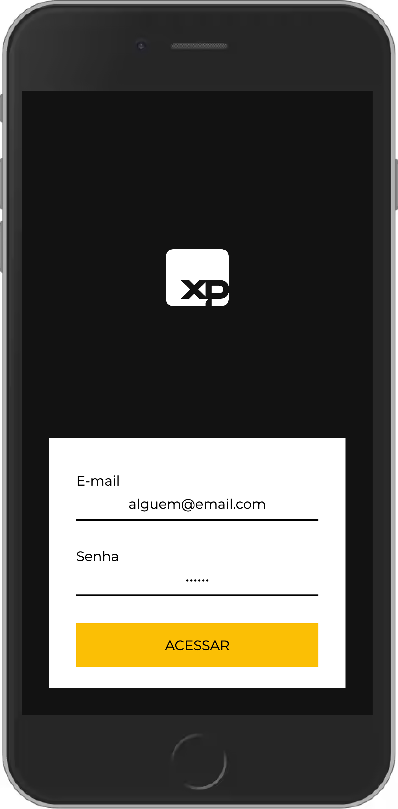
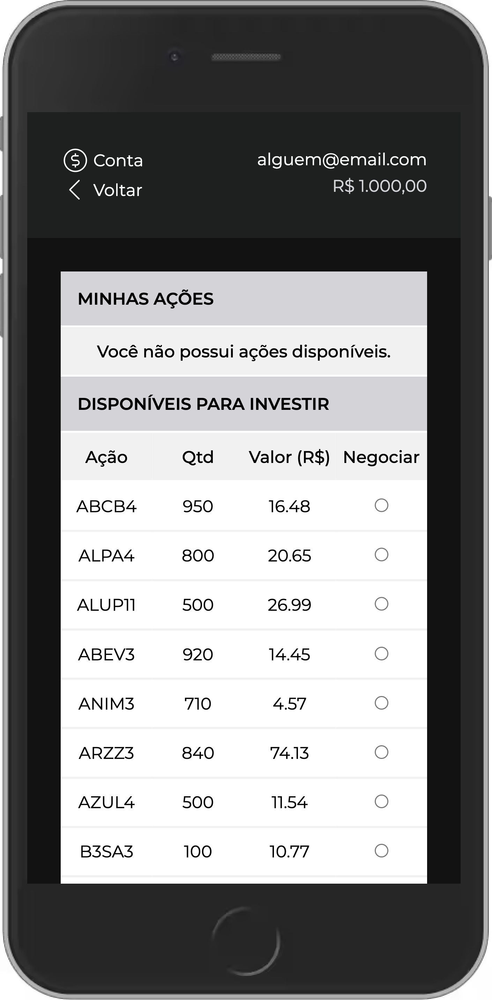
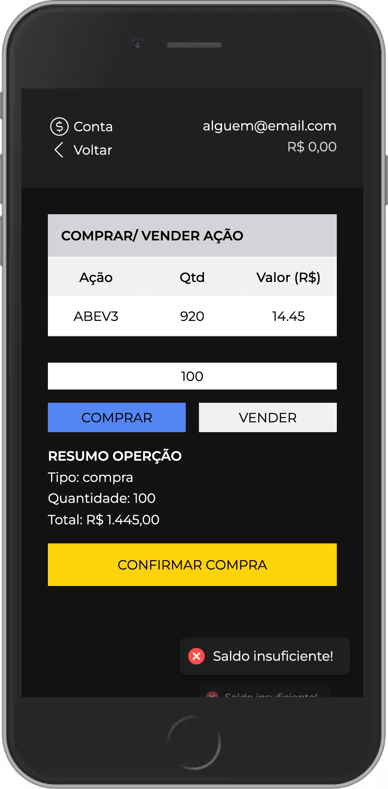
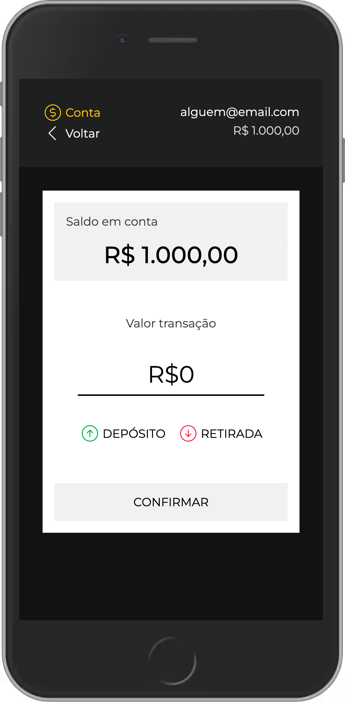

# Desafio Front-end - Processo seletivo XP

## Sobre o projeto

Neste projeto desenvolvi um aplicativo de investimento em ações e conta digital. Ele é estruturado por quatro telas:

- Login
- Listagem de ações do usuário e dispoíveis para investir
- Compra e venda de ações
- Conta digital.

<p align="center">
  
  &nbsp
  
  &nbsp
  
  &nbsp
  
</p>

## Tecnologias utilizadas

- [TypeScript](https://www.typescriptlang.org/)
- [React.js](https://reactjs.org/)
- [Redux Toolkit](https://redux-toolkit.js.org/)
- [Styled Components](https://styled-components.com/)
- [Jest](https://jestjs.io/pt-BR/)

## Como baixar e executar o projeto

- Clonar o repositório:

```
    git clone git@github.com:MarianeAlgayer/psel-xp-front-end.git
```

- Entrar no diretório do projeto:

```
    cd psel-xp-front-end/front-end
```

- Instalar as dependências:

```
    npm install
```

- Executar o projeto:

```
    npm start
```
## Testes

- Para rodar os testes:

```
    npm test
```

## Deploy

Você também pode acessar o projeto aqui: [deploy link](https://psel-xp-front-end-mariane.vercel.app/).

<p align="right"><a href="#top">Voltar ao topo</a></p>
